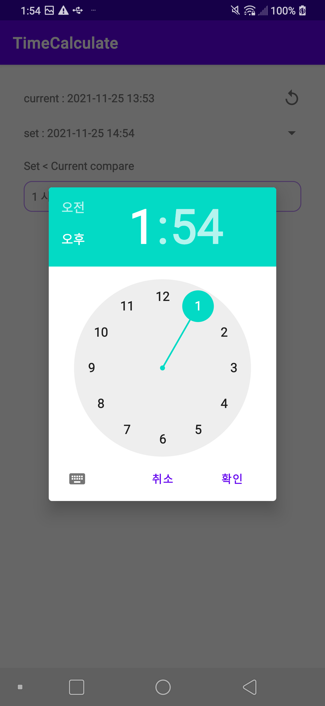
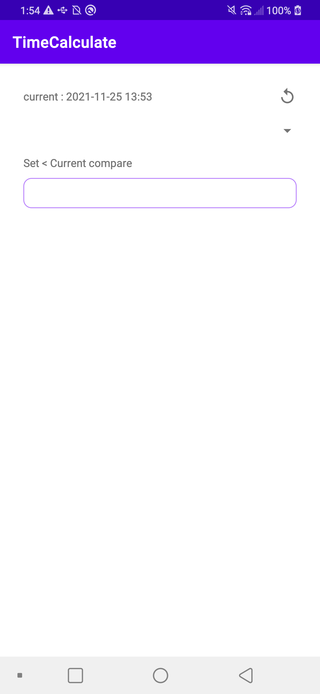
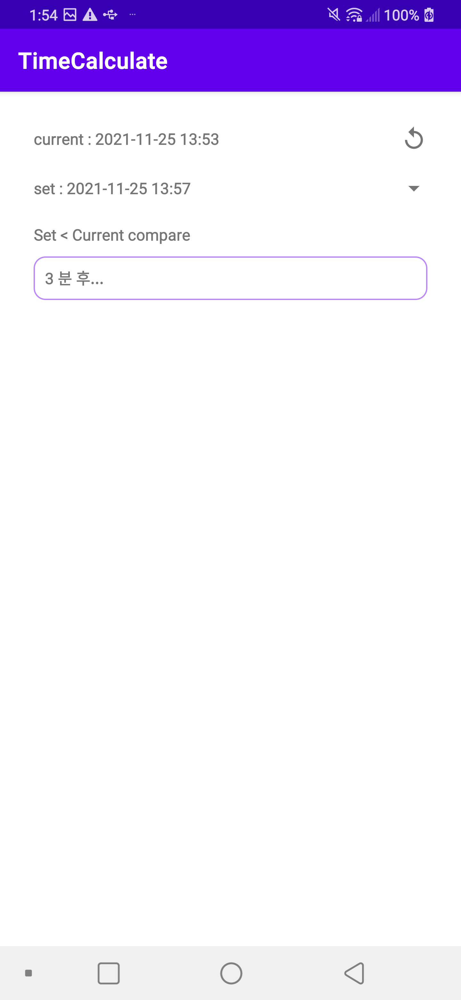
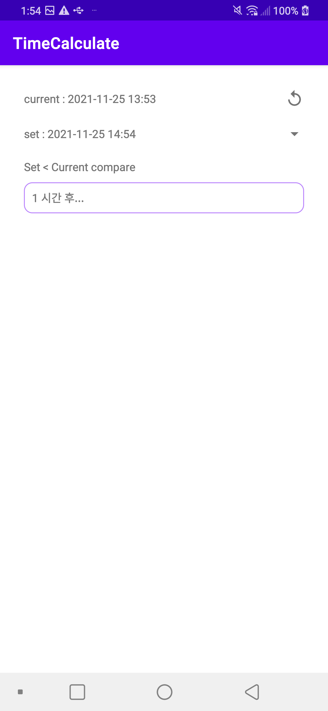

TimeCalculate Sample
====================
시간비교 로직 예시

Introduction
------------
시간비교 로직 예시
1) 지금
2) x분 전 (후)
3) x시간 전 (후)
4) x일 전 (후)
5) x달 전 (후)
6) x년 전 (후)

Getting Started
---------------

Screenshots
-----------

Support
-------

- Stack Overflow:
  - https://developer.android.com/guide/topics/ui/controls/pickers

